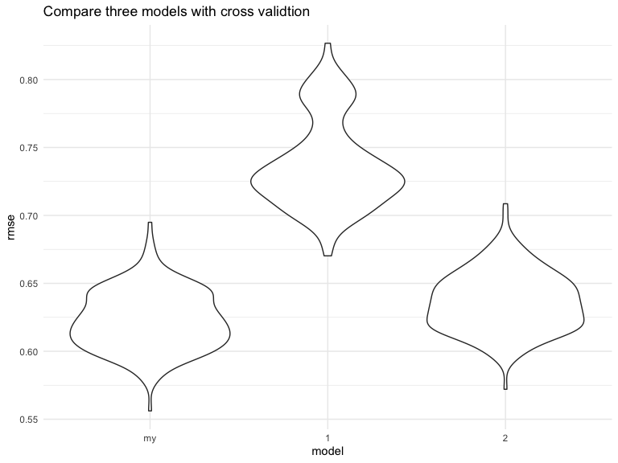
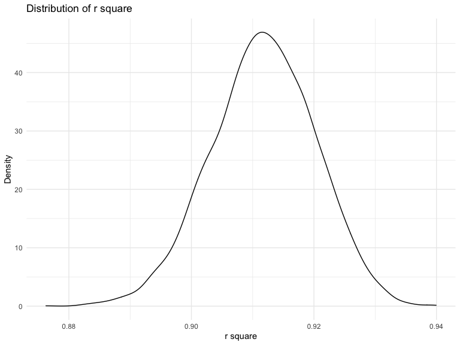

hmk6
================
Xinyi Wang
12/7/2020

``` r
library(tidyverse)
library(modelr)
library(p8105.datasets)
```

### Problem 1

``` r
homicide_df = 
  read_csv("homicide-data.csv", na = c("", "NA", "Unknown")) %>% 
  mutate(
    city_state = str_c(city, state, sep = ", "),
    victim_age = as.numeric(victim_age),
    resolution = case_when(
      disposition == "Closed without arrest" ~ 0,
      disposition == "Open/No arrest"        ~ 0,
      disposition == "Closed by arrest"      ~ 1)
  ) %>% 
  filter(
    victim_race %in% c("White", "Black"),
    city_state != "Tulsa, AL") %>% 
  select(city_state, resolution, victim_age, victim_race, victim_sex)
```

    ## Parsed with column specification:
    ## cols(
    ##   uid = col_character(),
    ##   reported_date = col_double(),
    ##   victim_last = col_character(),
    ##   victim_first = col_character(),
    ##   victim_race = col_character(),
    ##   victim_age = col_double(),
    ##   victim_sex = col_character(),
    ##   city = col_character(),
    ##   state = col_character(),
    ##   lat = col_double(),
    ##   lon = col_double(),
    ##   disposition = col_character()
    ## )

Start with one city.

``` r
baltimore_df =
  homicide_df %>% 
  filter(city_state == "Baltimore, MD")
glm(resolution ~ victim_age + victim_race + victim_sex, 
    data = baltimore_df,
    family = binomial()) %>% 
  broom::tidy() %>% 
  mutate(
    OR = exp(estimate),
    CI_lower = exp(estimate - 1.96 * std.error),
    CI_upper = exp(estimate + 1.96 * std.error)
  ) %>% 
  select(term, OR, starts_with("CI")) %>% 
  knitr::kable(digits = 3)
```

| term              |    OR | CI\_lower | CI\_upper |
| :---------------- | ----: | --------: | --------: |
| (Intercept)       | 1.363 |     0.975 |     1.907 |
| victim\_age       | 0.993 |     0.987 |     1.000 |
| victim\_raceWhite | 2.320 |     1.648 |     3.268 |
| victim\_sexMale   | 0.426 |     0.325 |     0.558 |

Try this across cities.

``` r
models_results_df = 
  homicide_df %>% 
  nest(data = -city_state) %>% 
  mutate(
    models = 
      map(.x = data, ~glm(resolution ~ victim_age + victim_race + victim_sex, data = .x, family = binomial())),
    results = map(models, broom::tidy)
  ) %>% 
  select(city_state, results) %>% 
  unnest(results) %>% 
  mutate(
    OR = exp(estimate),
    CI_lower = exp(estimate - 1.96 * std.error),
    CI_upper = exp(estimate + 1.96 * std.error)
  ) %>% 
  select(city_state, term, OR, starts_with("CI")) 
```

``` r
models_results_df %>% 
  filter(term == "victim_sexMale") %>% 
  mutate(city_state = fct_reorder(city_state, OR)) %>% 
  ggplot(aes(x = city_state, y = OR)) + 
  geom_point() + 
  geom_errorbar(aes(ymin = CI_lower, ymax = CI_upper)) + 
  theme(axis.text.x = element_text(angle = 90, hjust = 1))
```


## Problem 2

\#\#\#load data

``` r
baby_df = 
  read_csv("birthweight.csv") 
```

    ## Parsed with column specification:
    ## cols(
    ##   .default = col_double()
    ## )

    ## See spec(...) for full column specifications.

### clean the data for regression

There is no missing data.

``` r
baby_df = 
 baby_df %>% 
 mutate(
  babysex = factor(case_when(
   babysex == 1 ~ "male",
   babysex == 2 ~ "female"
   )),
  frace = factor(case_when(
   frace == 1 ~ "white",
   frace == 2 ~ "black",
   frace == 3 ~ "asion",
   frace == 4 ~ "puerto",
   frace == 8 ~ "other",
   frace == 9 ~ "unknown")),
  malform = factor(case_when(
   malform == 0 ~ "absent",
   malform == 1 ~ "present"
  )),
  mrace = factor(case_when(
   mrace == 1 ~ "white",
   mrace == 2 ~ "black",
   mrace == 3 ~ "asion",
   mrace == 4 ~ "puerto",
   mrace == 8 ~ "other")),
  
# turn grams into pounds
  bwt = bwt *0.00220462262185
 ) 
 

sum(is.na(baby_df))
```

    ## [1] 0

### take a look at variables

Finally choose 7 parameters with p-value \< 0.05. They are babysex,
bhead, blength, delwt, gaweeks, parity, smoken.

``` r
baby_df %>% 
 lm(bwt ~ ., data = .) %>% 
 broom::tidy() %>% 
 filter (p.value < 0.05 ) %>% 
 knitr::kable()
```

| term        |     estimate | std.error |  statistic |   p.value |
| :---------- | -----------: | --------: | ---------: | --------: |
| (Intercept) | \-13.9041902 | 1.4534283 | \-9.566478 | 0.0000000 |
| babysexmale |  \-0.0632888 | 0.0186627 | \-3.391197 | 0.0007021 |
| bhead       |    0.2883165 | 0.0076111 |  37.881183 | 0.0000000 |
| blength     |    0.1652444 | 0.0044570 |  37.075161 | 0.0000000 |
| delwt       |    0.0090406 | 0.0008704 |  10.386330 | 0.0000000 |
| gaweeks     |    0.0254620 | 0.0032306 |   7.881561 | 0.0000000 |
| parity      |    0.2106321 | 0.0892415 |   2.360248 | 0.0183069 |
| smoken      |  \-0.0107020 | 0.0012942 | \-8.269011 | 0.0000000 |

### look at the model with filtered parameter

``` r
my_model = lm(bwt ~ babysex + bhead + blength + delwt + gaweeks + parity + smoken, data = baby_df) 


my_model %>% 
 broom::tidy() %>% 
 select(term, estimate, p.value)
```

    ## # A tibble: 8 x 3
    ##   term         estimate   p.value
    ##   <chr>           <dbl>     <dbl>
    ## 1 (Intercept) -13.8     0.       
    ## 2 babysexmale  -0.0656  6.60e-  4
    ## 3 bhead         0.302   1.33e-282
    ## 4 blength       0.174   5.20e-274
    ## 5 delwt         0.00457 4.37e- 25
    ## 6 gaweeks       0.0317  1.84e- 21
    ## 7 parity        0.226   1.42e-  2
    ## 8 smoken       -0.00478 1.96e-  4

``` r
baby_df %>%
  modelr::add_residuals(my_model) %>% 
  modelr::add_predictions(my_model)%>% 
  ggplot(aes(x = pred, y = resid)) +
  geom_point(alpha = 0.3) +
  geom_smooth(method = "lm", color = "red", linetype = 2) +
  labs(title = "plot of Predictions and Residuals(pounds)", 
       x = "Predictions ", 
       y = "Residuals")
```

    ## `geom_smooth()` using formula 'y ~ x'


From the plot, we can see that all points are gathered together. There
is no significant relationship between them.

### Compare models to two others

``` r
model_1 = lm(bwt ~ blength + gaweeks, data = baby_df)
model_1 %>% 
 broom::tidy() %>% 
 select(term, estimate, p.value)
```

    ## # A tibble: 3 x 3
    ##   term        estimate  p.value
    ##   <chr>          <dbl>    <dbl>
    ## 1 (Intercept)  -9.58   0.      
    ## 2 blength       0.283  0.      
    ## 3 gaweeks       0.0596 2.36e-54

``` r
model_2 = lm(bwt ~ bhead * blength * babysex, data = baby_df)
model_2 %>% 
 broom::tidy() %>% 
 select(term, estimate, p.value)
```

    ## # A tibble: 8 x 3
    ##   term                       estimate    p.value
    ##   <chr>                         <dbl>      <dbl>
    ## 1 (Intercept)                -1.77    0.467     
    ## 2 bhead                      -0.0366  0.626     
    ## 3 blength                    -0.0477  0.354     
    ## 4 babysexmale               -14.1     0.000147  
    ## 5 bhead:blength               0.00733 0.00000317
    ## 6 bhead:babysexmale           0.437   0.000105  
    ## 7 blength:babysexmale         0.273   0.000429  
    ## 8 bhead:blength:babysexmale  -0.00855 0.000245

### compare with cross validation

``` r
cv_df =
  crossv_mc(baby_df, 200) %>% 
  mutate(
    train = map(train, as_tibble),
    test = map(test, as_tibble))

cv_df = 
  cv_df %>% 
  mutate(
    my_model  = map(train, ~lm(bwt ~ babysex + bhead + blength + delwt + gaweeks + parity + smoken, data = baby_df)),
    model_1  = map(train, ~lm(bwt ~ blength + gaweeks, data = baby_df)),
    model_2  = map(train, ~lm(bwt ~ bhead * blength * babysex, data = baby_df))) %>% 
  mutate(
    rmse_my = map2_dbl(my_model, test, ~rmse(model = .x, data = .y)),
    rmse_1 = map2_dbl(model_1, test, ~rmse(model = .x, data = .y)),
    rmse_2 = map2_dbl(model_2, test, ~rmse(model = .x, data = .y)))
```

### make a plot to see the comparison

``` r
cv_df %>% 
  select(starts_with("rmse")) %>% 
  pivot_longer(
    everything(),
    names_to = "model", 
    values_to = "rmse",
    names_prefix = "rmse_") %>% 
  mutate(model = fct_inorder(model)) %>% 
  ggplot(aes(x = model, y = rmse)) + geom_violin() +
  labs( 
   title = "Compare three models with cross validtion")
```



We could find out that my\_model has lowest rmse, which means that it
could be the best model among these three models, and the model using
length at birth and gestational age as prediction has the highest rmse
and performs worst.

## Problem 3

### load data

``` r
weather_df = 
  rnoaa::meteo_pull_monitors(
    c("USW00094728"),
    var = c("PRCP", "TMIN", "TMAX"), 
    date_min = "2017-01-01",
    date_max = "2017-12-31") %>%
  mutate(
    name = recode(id, USW00094728 = "CentralPark_NY"),
    tmin = tmin / 10,
    tmax = tmax / 10) %>%
  select(name, id, everything())
```

    ## Registered S3 method overwritten by 'hoardr':
    ##   method           from
    ##   print.cache_info httr

    ## using cached file: /Users/wxy/Library/Caches/R/noaa_ghcnd/USW00094728.dly

    ## date created (size, mb): 2020-10-05 16:54:17 (7.522)

    ## file min/max dates: 1869-01-01 / 2020-10-31

``` r
boot_straps = 
  weather_df %>% 
  modelr::bootstrap(n = 5000) %>% 
  mutate(
    models = map(strap, ~lm(tmax ~ tmin, data = .x) ),
    results = map(models, broom::tidy),
    glance = map(models, broom::glance)) %>%
  unnest(results, glance) %>% 
  select(.id, term, estimate, r.squared)
```

### calculate log\_beta and r.square

``` r
boot_straps = 
 boot_straps %>% 
 pivot_wider(
    names_from = term,
    values_from = estimate) %>% 
  rename(
    beta_0 = `(Intercept)`,
    beta_1 = tmin) %>% 
  mutate(log_beta = log(beta_0*beta_1)) %>% 
  select(r.squared, log_beta)
```

### Plot distribution of my estimate

``` r
boot_straps %>% 
 ggplot(aes(x = log_beta)) +
 geom_density() +
 labs(
  title = "Distribution of log beta",
  x = "log beta",
  y= "Density"
 )
```


``` r
boot_straps %>% 
 ggplot(aes(x = r.squared)) +
 geom_density() +
 labs(
  title = "Distribution of r square",
  x = "r square",
  y= "Density"
 )
```



We could find that both log\_beta and r square are nearly normal
distribution. And r square is quite large, which indicates that tim and
tmax are relative to some extent.

### confidence intercal for r square and log beta

``` r
boot_straps %>% 
  summarize(
    estimate = c("r square", "log beta"),
    ci_lower = c(quantile(r.squared, 0.025), quantile(log_beta, 0.025)),
    ci_upper = c(quantile(r.squared, 0.975), quantile(log_beta, 0.975))) %>% 
  knitr::kable()
```

| estimate | ci\_lower | ci\_upper |
| :------- | --------: | --------: |
| r square | 0.8944297 | 0.9277775 |
| log beta | 1.9642117 | 2.0599286 |
